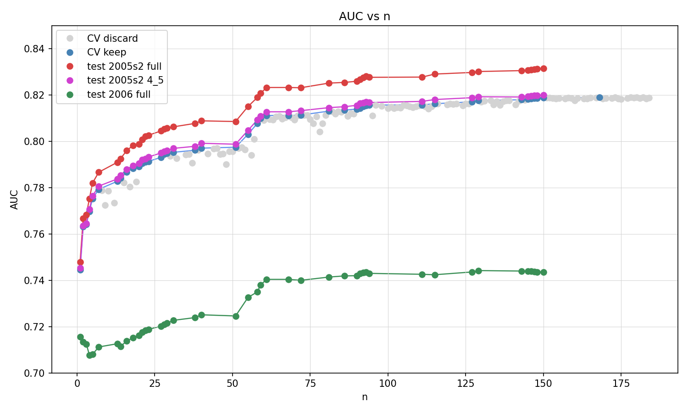
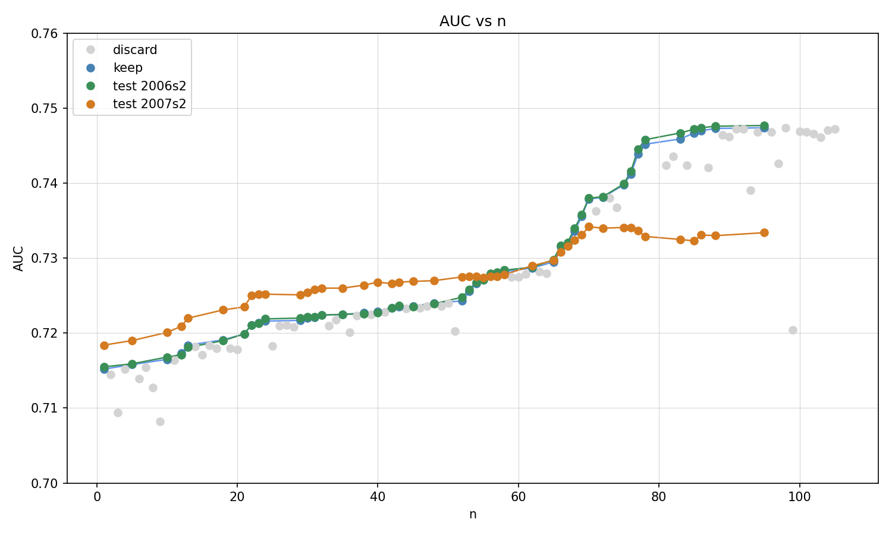

## Automating Data Science: Tuning Machine Learning Models with AI Agents

#### by Szilard Pafka and Eduardo Arino de la Rubia

**TL;DR** In this project we demonstrate that AI coding agents of today can be used to automate data science tasks such as feature engineering and model tuning (hyperparameter optimization) of machine learning models. AI agents can do research, learn domain knowledge and make informed decisions about what to try next. They can automate some of the tedious manual tasks of a data scientist in trying out hundreds of feature engineering and model tuning ideas/candidates. They can evaluate what worked/hasn’t worked so far and proceed further accordingly. This does not mean at all that the role of a data scientist can be completely substituted by AI as of today. The data scientist is driving the AI and also monitors, interprets and assesses the results. The AI agent is rather a tool that can significantly augment the data scientist by automating some of the manual tasks, a huge productivity gain. 

-----------------

For several decades the highest-valued data in companies has been in structured, tabular format. Extracting value from such data involves a data science process incorporating data preparation, training machine learning models, optimizing the model parameters and ensembling select models. In most practical applications with tabular data the models achieving the highest accuracy have been gradient boosting machines (GBMs) with popular open source implementations such as XGBoost or LightGBM. Developing such models involves writing code for feature engineering, model training, experimenting with hyperparameter optimization (tuning) and optionally ensembling select models. 

In the past few months AI coding agents such as Claude Code have revolutionized software development and more and more computer code is written by AI. Inspired by Andrej Karpathy’s Autoresearch project that uses AI agents to perform research and do experiments with retraining a large language model in order to obtain a better one (using AI to improve AI), we created a template that can be used by an AI agent to iterate over candidates for feature engineering transformations and XGBoost settings (hyperparameter values) and obtain increasingly better machine learning models on a given dataset. This template (open sourced and available on github) can easily be adapted for new datasets, new machine learning models (e.g. LightGBM) or even ensembling select models. 

In the github repository we also provide an end-to-end example in which we use Claude Code with our framework to optimize a binary classification XGBoost model on a given dataset in 2 scenarios. In the first scenario, the agent optimizes the model (feature engineering and hyperparameter values) using 5-fold cross validation on a sample of 100,000 records and tracks the AUC (area under the curve) accuracy metric as it iterates over candidate models. In each iteration the AI agent comes up “intelligently” with a new candidate model and the model is kept if AUC improved, otherwise it is discarded. We track post-hoc the AUC of the “full model” retrained on the complete sample (all 5 folds using the same hyperparameter values) by using for evaluation a separate larger sample from the same original dataset, the “4/5 model” (trained on 4-folds to be comparable in AUC with the CV models), and finally the AUC on a “time-separated” sample of the dataset (data from year 2006 vs all other data from 2005). The results are shown below.

As it can be seen, the AI agent is successful in delivering models that have higher accuracy, similar to a human data scientist who tries out different feature engineering transformations and tweaks the hyperparameters until he/she obtains better models. Also similar to the human data scientist, the AI agent uses domain knowledge (by doing “research” on the internet, reading the literature e.g. blog posts from machine learning competitions etc.) in order to make informed decisions about what to try next. The graph shows in grey the discarded models (lower AUC), in blue the CV AUC for the kept models, in magenta the AUC of the 4/5 model (matching the CV AUC), in red the AUC of the full model (higher, since it was trained on 25% larger data than the CV models) and finally in green the AUC on a time-separated data sample (lower because the distribution in real-world datasets change in time making prediction harder). All AUCs show improvement, showing the effectiveness of our framework and the AI agent in improving the model. 

In a second scenario, the AI agent trains the model on 2005 data (100,000 records), but in order to decide whether to keep or discard the model it evaluates it on 2006 data (100,000 records). We also evaluate the models post-hoc on a larger 2006 sample and also on a 2007 sample. The respective AUCs are shown below. One can see the AUC on the separate larger 2006 post-hoc sample is in line with the AUC on the data used for evaluation and keep/discard by the AI, therefore this multiple-evaluation setup does not lead to overfitting. The AI agent is successful in delivering models that have higher accuracy in this scenario as well, albeit the improvement on the 2007 data is less significant (due to distribution changes over time).

In this project we have demonstrated that AI coding agents of today can be used to automate data science tasks such as feature engineering and model tuning (hyperparameter optimization). AI agents can do research, learn domain knowledge and make informed decisions about what to try next. They can automate some of the tedious manual tasks of a data scientist in trying out hundreds of feature engineering and model tuning ideas/candidates. They can evaluate what worked/hasn’t worked so far and proceed further accordingly. This does not mean at all that the role of a data scientist can be completely substituted by AI as of today. The data scientist is driving the AI (in our case by changing the program.md file providing the instructions to the AI agent) and also monitors, interprets and assesses the results. The human also defines the initial problem, sets up the context (the datasets etc.) or overall manages the project. The AI agent of today is a tool that can significantly augment the data scientist by automating some of the manual tasks, a huge productivity gain for the human rather than a replacement. 

